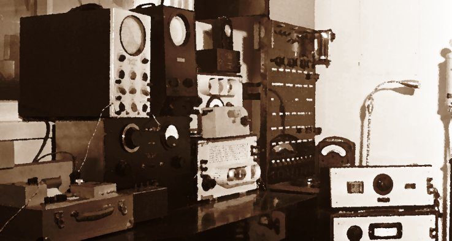

<p align="center">

</p>

# low-fi
Low Fidelity handing of ssh and file touching.. 8 Track Tapes

## Group 

Group is a simple cli toolset for managing ssh through backticks and inifiles 

```
group_put - scp to many
group_do - ssh to many
```

## Grope 

Grope is similiar to Group tools except that is uses alot more useless like json

It also does things like 'get handsy' with a file system to make sure its ok.. :-)

Create / Modify / Delete a file in one command. 

## Do not look at this ..

This is a pile of Low Fi Crap.. 
